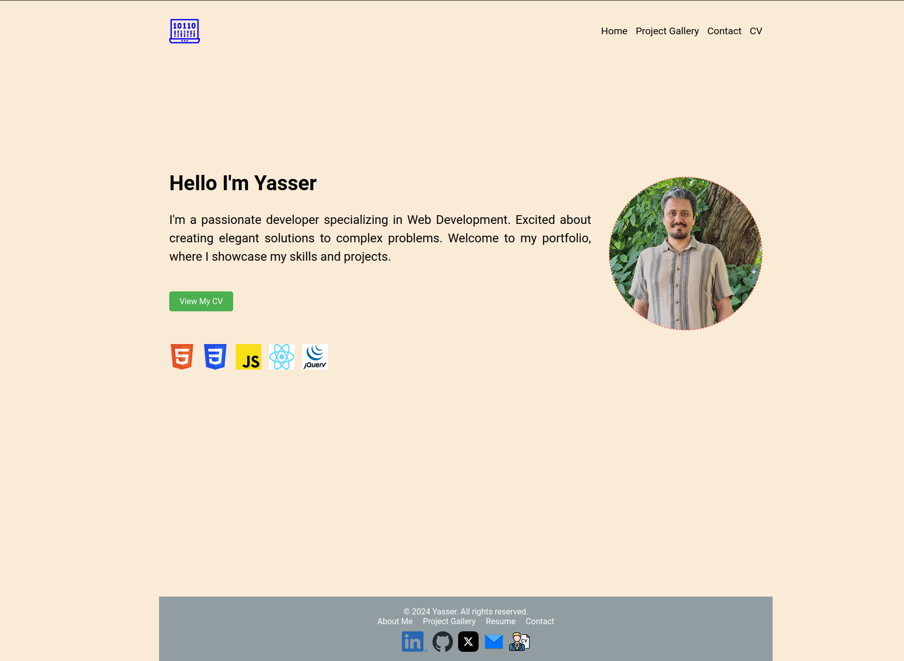

# React Portfolio App

## Introduction
React Portfolio App is a simple, responsive web application designed to showcase a portfolio of frontend apps. It features a clean and intuitive interface with a home page, a contact page, and a project gallery page. The application is built using React and is fully responsive, making it accessible on both desktop and mobile screens.

## Features
- **Home Page**: A welcoming landing page that introduces visitors to the portfolio.
- **Contact Page**: A page where visitors can find contact information and reach out.
- **Project Gallery Page**: This page showcases a collection of frontend projects with descriptions and links.
- **CV Download**: Potential employers can easily download the CV from the home page, the navbar, or the footer.

## Technologies Used
- React
- HTML
- JavaScript
- CSS

## Installation
This application does not require any special installation steps. Simply clone the repository and open the `index.html` file in a web browser to view the app.

## Usage
Navigate through the app using the menu to view different sections:
- The Home Page for an introduction.
- The Contact Page to find contact details.
- The Project Gallery to view the portfolio of projects.

## Screenshot

## Contact
For any inquiries or questions, feel free to contact me at [yaserrezvany@gmail.com](mailto:yaserrezvany@gmail.com).

---

React Portfolio App © 2024 [Yasser Rezvani]
